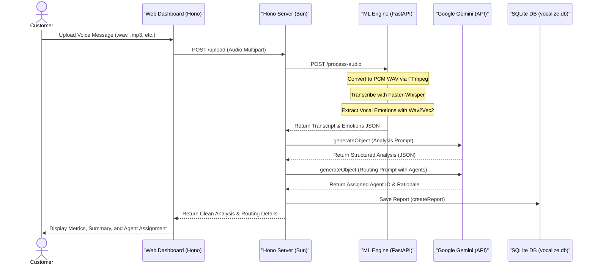

# 🎙️ Vocalize AI — Voice Message Intelligence Platform

Vocalize AI is a state-of-the-art customer support intelligence engine. It is designed to process **single-person customer voice notes** (e.g., WhatsApp audio messages explaining complaints or requests) and extract deep linguistic, vocal, and emotional insights.

The platform uses local speech-to-text and emotion classification models alongside Google Gemini LLMs to analyze transcripts and **semantically route customer issues** to the best-suited support agent.

---

## ⚡ Key Features

- **Local Machine Learning Pipeline**: 
  - **Speech-to-Text**: Transcribes audio notes locally using CPU-optimized `faster-whisper` (small, Int8 quantized model).
  - **Emotion Classification**: Uses a fine-tuned `wav2vec2-base-arabic` speech emotion model to capture primary vocal emotions (Happy, Angry, Sad, Neutral, etc.) directly from audio patterns.
- **AI-Powered Conversation Analysis**: Leveraging Google Gemini to automatically generate:
  - Concise bilingual summaries (English and Egyptian Arabic).
  - Relevant topic tagging and keywords.
  - Verification of whether the message contains a real customer complaint or is just noise/silence.
- **Structured Behavioral Metrics**: Converts raw psychological signals into a premium dashboard displaying:
  - **Engagement / Seriousness** (مدى الجدية)
  - **Frustration Level** (درجة الانزعاج)
  - **Confidence & Assertiveness** (درجة الثقة)
  - **Audio Clarity** (وضوح الصوت)
  - **Urgency Level** (مستوى الإلحاح)
  - **Explanation Details** (وضوح الشرح)
- **AI-Powered Semantic Routing**: Evaluates customer problems semantically against available support agent profiles (specializations and topic lists) to assign the ticket to the best agent, providing a bilingual rationale (Routing Reason).
- **Egyptian Arabic Native Layout**: Full bilingual toggle (EN/AR). All Arabic prompts and outputs are tailored in professional Egyptian business Arabic—direct, warm, and natural.
- **Manager-Friendly CSV Exporter**: Generates clean spreadsheet reports complete with percentage marks, readable formatting, and Arabic summaries for company managers.
- **Modern Premium Interface**: Responsive glassmorphism interface with dark/light themes and custom micro-animations.

---

## 🏗️ System Architecture & Workflow



---

## 🛠️ Installation & Setup

### 1. Prerequisites
- **Bun**: [Install Bun runtime](https://bun.sh/)
- **Python 3.10+**
- **FFmpeg**: Must be installed and available in your system's PATH.
  - *macOS*: `brew install ffmpeg`
  - *Linux*: `sudo apt install ffmpeg`

### 2. Environment Configuration
Create a `.env.local` file in the root directory:
```env
GOOGLE_GENERATIVE_AI_API_KEY=your_gemini_api_key_here
HF_TOKEN=your_huggingface_write_token_here
```

### 3. Machine Learning Python Server Setup
```bash
# Create and activate virtual environment
python -m venv venv
source venv/bin/activate  # On Windows use: venv\Scripts\activate

# Install required packages
pip install fastapi uvicorn faster-whisper transformers torch torchaudio python-multipart soundfile
```

### 4. Orchestrator Server Setup
```bash
# Install Node dependencies
bun install
```

---

## 🏃 Running the Application

### 1. Seed the Database
Initialize the SQLite database with a clean table schema and a collection of 6 specialized support agents:
```bash
bun run src/seed.ts
```

### 2. Start the Machine Learning API Server
Run the FastAPI application:
```bash
source venv/bin/activate
python main.py
```
*The Python server will run on `http://localhost:8000`.*

### 3. Start the Orchestration Web Server
In a new terminal window:
```bash
bun run dev
```
*The web dashboard will be available at `http://localhost:3000`.*
- Open `http://localhost:3000` for the customer/analyst upload portal.
- Open `http://localhost:3000/admin` to view the Admin Dashboard, inspect customer reports, manage support agents, and export the manager-friendly CSV.

---

## 📄 License
This project is licensed under the MIT License.
